<div align="center">
  
</div>

<h1 align="center">Woow LiteLLM MCP Server</h1>

<p align="center">
  A production-grade MCP server suite that turns a <a href="https://github.com/BerriAI/litellm">LiteLLM</a> gateway
  into 40 governed, auditable tools — with a React admin console, an encrypted reverse proxy,
  and a Kubernetes deployment that needs no private registry.
</p>

<p align="center">
  <a href="#overview">Overview</a> &bull;
  <a href="#features">Features</a> &bull;
  <a href="#architecture">Architecture</a> &bull;
  <a href="#packages">Packages</a> &bull;
  <a href="#screenshots">Screenshots</a> &bull;
  <a href="#installation">Installation</a> &bull;
  <a href="#configuration">Configuration</a> &bull;
  <a href="#security">Security</a> &bull;
  <a href="#api-reference">API Reference</a> &bull;
  <a href="#testing">Testing</a> &bull;
  <a href="./README_zh-TW.md">繁體中文</a>
</p>

<p align="center">
  
  
  
  
  
</p>

---

## Overview

A LiteLLM gateway is a powerful thing to hand to an AI agent and a dangerous thing to
hand to one carelessly. Its admin API can mint virtual keys, delete model deployments,
evict team members and read every request's spend record. This repository is the layer
in between: it exposes that API as **40 named MCP tools**, each one classified by
category, CRUD operation and blast radius, so an operator can decide exactly which
subset a given agent is allowed to touch — and then prove, from a single source of
truth, that the decision is being enforced.

The suite is deployed and running. The gateway it administers is LiteLLM
**v1.83.14-stable** (community edition) serving five OpenRouter-backed model
deployments; the admin console is reachable at `https://litellm-mcp.woowtech.io` and
the gateway itself at `https://litellm.woowtech.io`. Every number, table and screenshot
in this document was pulled from those live services rather than written from memory —
the usage figures in [Screenshots](#screenshots) are the real seven-day window ending
5 August 2026, and the tool catalogue in [API Reference](#api-reference) was generated
by importing the registry module itself.

Three properties define the design. **The registry is the single source of truth**:
`woow_litellm_mcp_server/registry.py` holds all 40 `ToolSpec` records, and the MCP
server, the gating layer and the admin GUI all read from it — a test
(`tests/test_mcp_surface.py`) fails the build if the GUI could ever name a tool the
server does not register. **The MCP child never listens publicly**: it binds
`127.0.0.1` and the only route in is a path-token proxy whose token must match the
stored `mcp_auth_token`. **Nothing needs a private registry**: the Kubernetes manifests
clone this public repo in an `initContainer` and build in place, so a `kubectl apply`
is the entire deployment story.

---

## Features

**Forty tools across eight categories.** Model lifecycle (6), OpenAI-compatible chat
and token counting (2), virtual-key governance (8), teams (7), internal users (5),
spend and cost reporting (3), health probes (2) and the Claude-Code skill hub (7).
Eighteen of the forty are strictly read-only; eight are flagged dangerous and carry a
`[DESTRUCTIVE]` docstring prefix that MCP clients surface to the model before it calls
them.

**Four independent gating axes.** Disable whole categories
(`LITELLM_MCP_DISABLED_CATEGORIES=keys,teams`), individual tools
(`LITELLM_MCP_DISABLED_TOOLS=litellm_delete_key`), CRUD operations across the board
(`LITELLM_MCP_DISABLED_OPERATIONS=delete`), or flip
`LITELLM_MCP_READONLY=true` to drop every mutating tool at registration time. Gates
apply before the tool is registered, so a disabled tool is not merely refused — it is
absent from `tools/list` entirely, and no prompt-injection can talk the model into
calling something that does not exist.

**A real admin console, not a config file.** Eight React Router pages — dashboard,
tool manager, connection config, token manager, live log viewer, permission editor,
settings and login — served by FastAPI behind JWT auth. The tool manager renders one
switch per registry entry, grouped by category, with the dangerous ones visually
marked. The log viewer streams the server's ring buffer over SSE.

**Path-token isolation for the public endpoint.** The console publishes exactly one
MCP door: `/private_<mcp_auth_token>/mcp/`. Rotating the token from the Tokens page
kills the old URL instantly. The token lives in the path rather than a query string
deliberately — uvicorn logs full request lines, and a query-string secret would end up
in every access log entry.

**Registryless Kubernetes deployment.** `k8s-admin-deploy.yaml` uses three
`initContainers` (`alpine/git` to clone, `node:20-alpine` to build the SPA,
`python:3.12-slim` to seed the config PVC) so the cluster pulls only public upstream
images. Cold start is about two and a half to three minutes; the SPA
build step ends in `exit 0` by design so a frontend build failure degrades the console
rather than crash-looping the pod.

**Live-verified against a real gateway.** The test suite carries an opt-in `live`
marker that probes the actual deployment; the default run mocks LiteLLM's HTTP surface
and asserts each tool builds the right request and parses the right response.

---

## Architecture

### System topology

The suite is one container running one uvicorn process that fronts three things: the
admin API, the SPA, and a reverse proxy to a loopback-bound MCP child.

```
                       ┌─────────────────────── single container ───────────────────────────┐
  Claude / MCP client  │                                                                      │
        │              │  uvicorn  litellm_mcp_admin.main:app   (0.0.0.0:8080)                │
        │  HTTPS       │    ├─ AuthMiddleware (JWT)  ── /api/*  admin GUI + API               │
        ▼              │    ├─ proxy  /private_{token}/mcp/  ──┐                              │
  Cloudflare edge ─────┼──► └─ SPA (React)                     │ reverse proxy (nginx-free)   │
                       │                                       ▼                              │
                       │             McpProcessManager ► woow_litellm_mcp_server (127.0.0.1)  │
                       │                                       │  transport=http  /mcp/       │
                       └────────────────────────────────────────┼──────────────────────────────┘
                                                               ▼
                                        LiteLLM gateway  (Bearer master key, port 4000)
```

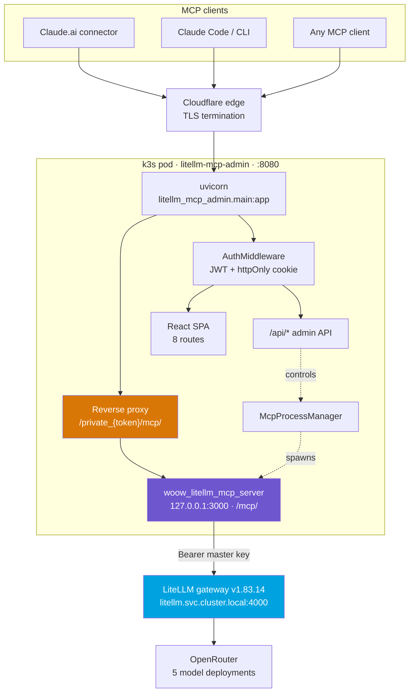
```mermaid
flowchart TB
    subgraph client["MCP clients"]
        C1["Claude.ai connector"]
        C2["Claude Code / CLI"]
        C3["Any MCP client"]
    end

    CF["Cloudflare edge<br/>TLS termination"]

    subgraph pod["k3s pod · litellm-mcp-admin · :8080"]
        UV["uvicorn<br/>litellm_mcp_admin.main:app"]
        AUTH["AuthMiddleware<br/>JWT + httpOnly cookie"]
        API["/api/* admin API"]
        SPA["React SPA<br/>8 routes"]
        PX["Reverse proxy<br/>/private_{token}/mcp/"]
        PM["McpProcessManager"]
        MCP["woow_litellm_mcp_server<br/>127.0.0.1:3000 · /mcp/"]
    end

    LLM["LiteLLM gateway v1.83.14<br/>litellm.svc.cluster.local:4000"]
    OR["OpenRouter<br/>5 model deployments"]

    C1 --> CF
    C2 --> CF
    C3 --> CF
    CF --> UV
    UV --> AUTH
    AUTH --> API
    AUTH --> SPA
    UV --> PX
    PX --> MCP
    PM -.spawns.-> MCP
    API -.controls.-> PM
    MCP -->|"Bearer master key"| LLM
    LLM --> OR

    style MCP fill:#6E56CF,color:#fff
    style LLM fill:#00A3E0,color:#fff
    style PX fill:#D97706,color:#fff
```

**Reading the diagram.** Everything inside the pod box shares one process boundary
except the MCP child, which `McpProcessManager` spawns as a subprocess bound to
loopback. That binding is the security invariant: there is no network path to the MCP
child that does not pass through the proxy, and the proxy refuses any request whose
path token does not equal the stored `mcp_auth_token`. The dashed arrows are control
rather than data — the admin API tells the process manager to start, stop or restart
the child, but admin traffic never flows through it. The single solid arrow leaving the
pod carries the LiteLLM master key as a Bearer header; that key exists only in a
Kubernetes Secret and in the container's environment, never in this repository.

### Request lifecycle

A tool call from Claude traverses six hops before it reaches OpenRouter, and each hop
can reject it.

```
  Claude          Cloudflare        Proxy route          MCP child         LiteLLM        OpenRouter
    │                  │                 │                   │                │               │
    │ tools/call ─────►│                 │                   │                │               │
    │                  │ TLS + WAF ─────►│                   │                │               │
    │                  │                 │ token match?      │                │               │
    │                  │                 │   ✗ → 404         │                │               │
    │                  │                 │   ✓ ─────────────►│                │               │
    │                  │                 │                   │ gated? ✗ → n/a │               │
    │                  │                 │                   │ ✓ build req ──►│               │
    │                  │                 │                   │                │ route ───────►│
    │                  │                 │                   │                │◄── completion │
    │                  │                 │                   │◄── JSON        │               │
    │◄──────────────── structured MCP result ────────────────│                │               │
```

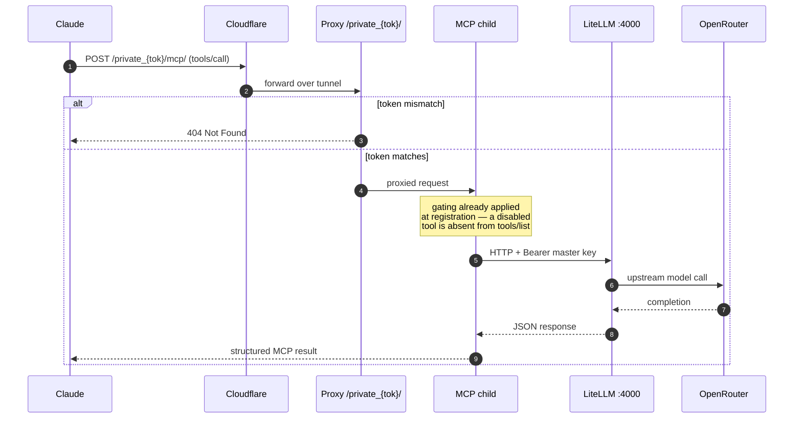
```mermaid
sequenceDiagram
    autonumber
    participant CL as Claude
    participant CF as Cloudflare
    participant PX as Proxy /private_{tok}/
    participant MC as MCP child
    participant LL as LiteLLM :4000
    participant OR as OpenRouter

    CL->>CF: POST /private_{tok}/mcp/ (tools/call)
    CF->>PX: forward over tunnel
    alt token mismatch
        PX-->>CL: 404 Not Found
    else token matches
        PX->>MC: proxied request
        Note over MC: gating already applied<br/>at registration — a disabled<br/>tool is absent from tools/list
        MC->>LL: HTTP + Bearer master key
        LL->>OR: upstream model call
        OR-->>LL: completion
        LL-->>MC: JSON response
        MC-->>CL: structured MCP result
    end
```

**Reading the diagram.** The critical detail is the note in the middle: gating is not a
runtime check on an incoming call, it happens once at registration. If
`litellm_delete_key` is gated off, the MCP child never registers it, so `tools/list`
never advertises it and a `tools/call` naming it fails as an unknown tool rather than
as a permission denial. That distinction matters for agent safety — a model cannot be
persuaded to invoke a capability it has never been told about. The `404` on token
mismatch is likewise deliberate: a wrong token yields the same response as a wrong
path, so probing the endpoint reveals nothing about whether a valid token exists.

### Tool registry model

Every tool is a frozen `ToolSpec`. The dataclass is small on purpose — seven fields
that together answer "what does this touch, how, and how badly can it go wrong".

```
  ToolSpec
  ├── name         litellm_delete_key
  ├── category     ToolCategory.KEYS
  ├── description  "[DESTRUCTIVE] Delete a virtual key…"
  ├── method       POST
  ├── path         /key/delete
  ├── operations   ("delete",)
  └── dangerous    True
                    │
                    ├──► gating.py      — decides registration
                    ├──► server.py      — registers with FastMCP
                    └──► admin GUI      — renders the switch + ⚠ badge
```

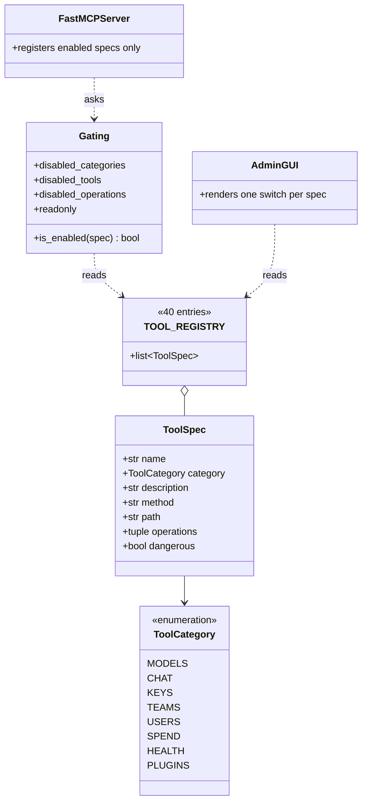
```mermaid
classDiagram
    class ToolSpec {
        +str name
        +ToolCategory category
        +str description
        +str method
        +str path
        +tuple operations
        +bool dangerous
    }
    class ToolCategory {
        <<enumeration>>
        MODELS
        CHAT
        KEYS
        TEAMS
        USERS
        SPEND
        HEALTH
        PLUGINS
    }
    class TOOL_REGISTRY {
        <<40 entries>>
        +list~ToolSpec~
    }
    class Gating {
        +disabled_categories
        +disabled_tools
        +disabled_operations
        +readonly
        +is_enabled(spec) bool
    }
    class AdminGUI {
        +renders one switch per spec
    }
    class FastMCPServer {
        +registers enabled specs only
    }

    ToolSpec --> ToolCategory
    TOOL_REGISTRY o-- ToolSpec
    Gating ..> TOOL_REGISTRY : reads
    FastMCPServer ..> Gating : asks
    AdminGUI ..> TOOL_REGISTRY : reads
```

**Reading the diagram.** Both consumers — the server and the GUI — depend on
`TOOL_REGISTRY` and neither maintains its own list. `litellm_mcp_admin/tool_registry.py`
is a pure re-export of the server's module with no additions, which is what makes the
invariant testable: `tests/test_mcp_surface.py` compares the GUI's tool names against
the server's registered set and fails if they diverge. The `operations` tuple is what
`LITELLM_MCP_DISABLED_OPERATIONS` matches against, and it is a tuple rather than a
single value because a few tools legitimately span two verbs.

### Deployment topology

Two namespaces, two deployments, one shared cluster DNS name between them.

```
  ┌── namespace: litellm ─────────────┐   ┌── namespace: litellm-mcp ──────────────────┐
  │                                   │   │                                            │
  │  Deployment  litellm              │   │  Deployment  litellm-mcp-admin             │
  │   image ghcr.io/berriai/litellm   │   │   strategy: Recreate                       │
  │        :v1.83.14-stable           │   │   ├─ init  git-clone     alpine/git        │
  │                                   │   │   ├─ init  spa-build     node:20-alpine    │
  │  Service  litellm  :4000  ◄───────┼───┼──   └─ init  seed-config   python:3.12-slim│
  │                                   │   │   └─ main  admin           :8080           │
  │  Secret   master key, salt key    │   │  PVC  litellm-mcp-data → /data/config.json │
  └─────────────────────────────────┘   └────────────────────────────────────────────┘
                  ▲                                          ▲
                  │ Cloudflare tunnel                        │ Cloudflare tunnel
           litellm.woowtech.io                       litellm-mcp.woowtech.io
```

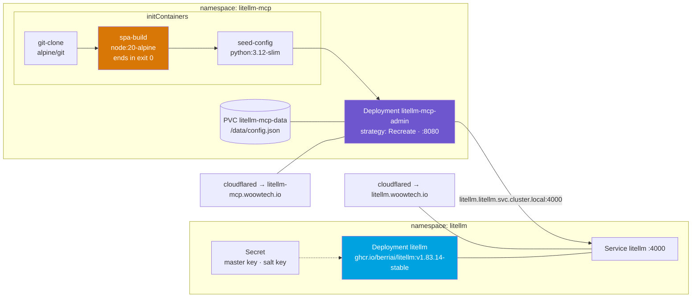
```mermaid
flowchart LR
    subgraph ns1["namespace: litellm"]
        D1["Deployment litellm<br/>ghcr.io/berriai/litellm:v1.83.14-stable"]
        S1["Service litellm :4000"]
        SEC["Secret<br/>master key · salt key"]
        D1 --- S1
        SEC -.-> D1
    end

    subgraph ns2["namespace: litellm-mcp"]
        subgraph init["initContainers"]
            I1["git-clone<br/>alpine/git"]
            I2["spa-build<br/>node:20-alpine<br/>ends in exit 0"]
            I3["seed-config<br/>python:3.12-slim"]
        end
        D2["Deployment litellm-mcp-admin<br/>strategy: Recreate · :8080"]
        PVC[("PVC litellm-mcp-data<br/>/data/config.json")]
        I1 --> I2 --> I3 --> D2
        PVC --- D2
    end

    T1["cloudflared → litellm.woowtech.io"]
    T2["cloudflared → litellm-mcp.woowtech.io"]

    D2 -->|"litellm.litellm.svc.cluster.local:4000"| S1
    T1 --- S1
    T2 --- D2

    style D1 fill:#00A3E0,color:#fff
    style D2 fill:#6E56CF,color:#fff
    style I2 fill:#D97706,color:#fff
```

**Reading the diagram.** The init chain runs in order and the middle step is the
interesting one: `spa-build` ends in `exit 0` unconditionally, so a broken `npm run
build` produces a console without a freshly built SPA rather than a pod stuck in
`Init:CrashLoopBackOff` — the previously built `dist/` committed to the repo still
serves. `strategy: Recreate` rather than `RollingUpdate` is required because `/repo` is
an `emptyDir` repopulated on every restart and the PVC is `ReadWriteOnce`; two pods
cannot hold it at once. The cross-namespace arrow uses the cluster-internal DNS name,
so gateway traffic never leaves the cluster even though both services also have public
tunnels.

---

## Packages

Every constituent package sits at the repository root — there is no wrapper directory,
so a `pip install .` from a fresh clone gets the MCP server and `pip install ".[admin]"`
adds the console.

| Package | Purpose | Key modules |
|---------|---------|-------------|
| **`woow_litellm_mcp_server/`** | The FastMCP server. Owns the canonical tool registry, the gating layer, the typed LiteLLM client and all 40 tool implementations. | `registry.py`, `gating.py`, `server.py`, `settings.py`, `deps.py`, `errors.py`, `lifespan.py`, `middleware.py`, `models.py` |
| **`woow_litellm_mcp_server/tools/`** | One module per category; each builds a request, calls the shared client and shapes the response. | `models.py`, `chat.py`, `keys.py`, `teams.py`, `users.py`, `spend.py`, `health.py`, `plugins.py`, `_common.py` |
| **`mcp_admin_core/`** | Product-agnostic admin core, reusable across the Woow MCP family. JWT middleware, file-backed config store, MCP subprocess manager, the reverse proxy and the SSE wrapper. | `app.py`, `proxy.py`, `process.py`, `discovery.py`, `mcp_sse_wrapper.py`, `auth/middleware.py`, `config/store.py`, `k8s/client.py`, `routers/settings.py` |
| **`litellm_mcp_admin/`** | The LiteLLM-specific console: FastAPI app, routers and the registry re-export the GUI reads. | `main.py`, `store.py`, `tool_registry.py`, `routers/{config,health,logs,tokens,tools}.py` |
| **`frontend/`** | Vite + React 19 SPA with React Router 7. Eight routes, JWT in `localStorage` plus an httpOnly cookie. | `src/App.jsx`, `src/api.js`, `src/pages/`, `src/components/`, `dist/` |
| **`cloudflare/`** | Optional Workers that give the MCP endpoint its own hostname and an OAuth discovery fallback. | `mcp-direct.js`, `mcp-oauth-gateway.js`, `wrangler.toml` |
| **`tests/`** | 13 test modules, 135 collected cases, mocked by default with an opt-in `live` marker. | `conftest.py` + `test_*.py` |
| **`docs/`** | Supplementary design notes and every screenshot in this README. | `architecture.md`, `tool-catalog.md`, `deployment.md`, `encrypted-proxy.md`, `screenshots/` |

Deployment and packaging artefacts also live at the root: `Dockerfile` (two-stage,
`node:20-alpine` → `python:3.12-slim`, `EXPOSE 8080`), `docker-compose.yml`,
`k8s-base.yaml` (namespace + gateway secret, no workload), `k8s-admin-deploy.yaml` (the
whole console stack), `pyproject.toml`, `mcp_admin_core.pyproject.toml`, `pytest.ini` and
`.env.example`.

The Python packages total **7,206 lines**; the frontend adds **3,507 lines** of JSX and
JS.

---

## Screenshots

Every image below was captured from the running deployment on 5 August 2026 through a
headless Chromium session — no mockups, no staged data. The console screenshots come
from `https://litellm-mcp.woowtech.io`, the gateway screenshots from
`https://litellm.woowtech.io/ui/`.

### Admin console — login

The single unauthenticated route. Submitting the form posts `{ password }` to
`/api/auth/login`, which returns a JWT and simultaneously sets an httpOnly
`mcp-admin-token` cookie so the SSE log stream can authenticate without putting the
token in a query string.

<div align="center">
  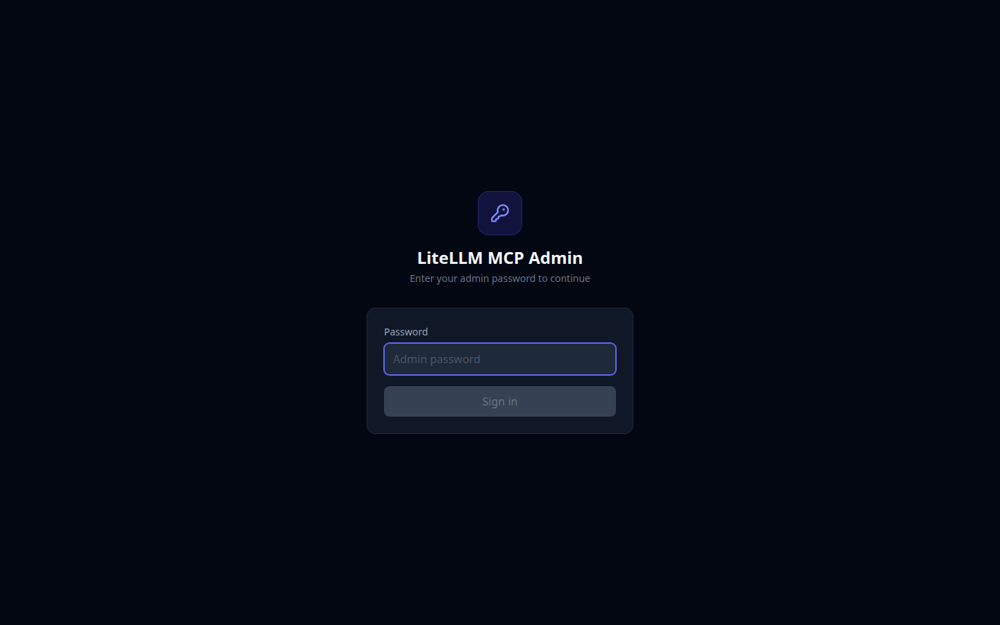
</div>

### Admin console — dashboard

The landing route after login. It reports the MCP child's live process state — at
capture time `PID: 93 · Restarts: 14 · running` — alongside the configured LiteLLM
target and the tool-surface summary. The restart counter is cumulative across the pod's
lifetime and is the fastest way to spot a child that is failing to stay up.

<div align="center">
  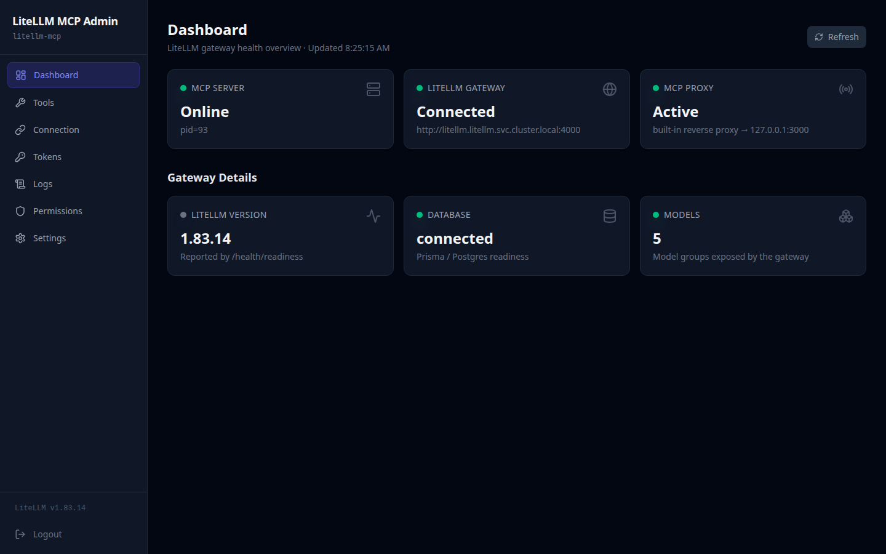
</div>

### Admin console — tool manager

All 40 tools, grouped into the eight categories, one switch each. The destructive eight
are badged so an operator disabling risky capabilities does not have to remember which
ones they are. Because this page renders straight from `TOOL_REGISTRY`, a tool added to
the server appears here on the next deploy with no frontend change.

<div align="center">
  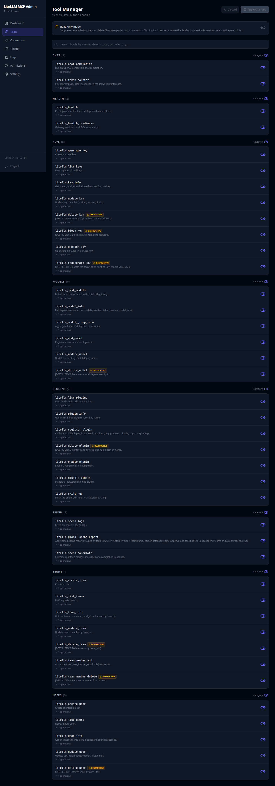
</div>

### Admin console — connection

Where the gateway target and credentials are set. The master key is write-only in the
API: it can be replaced but never read back, and every response masks it. The probe
button performs a real `/health/readiness` call against the configured base URL so a
typo surfaces immediately rather than at first tool call.

<div align="center">
  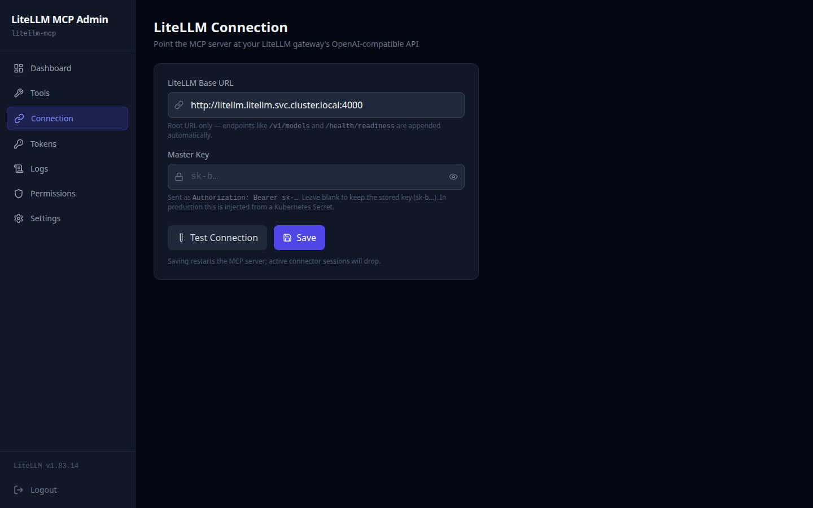
</div>

### Admin console — tokens

Manages `mcp_auth_token`, the secret embedded in the public MCP URL. Generating
previews a candidate without committing it; rotating replaces the live value and kills
the previous URL immediately, which disconnects every connected MCP client until they
are repointed. The distinction between generate and rotate is deliberate — it makes the
destructive action a separate, explicit click.

<div align="center">
  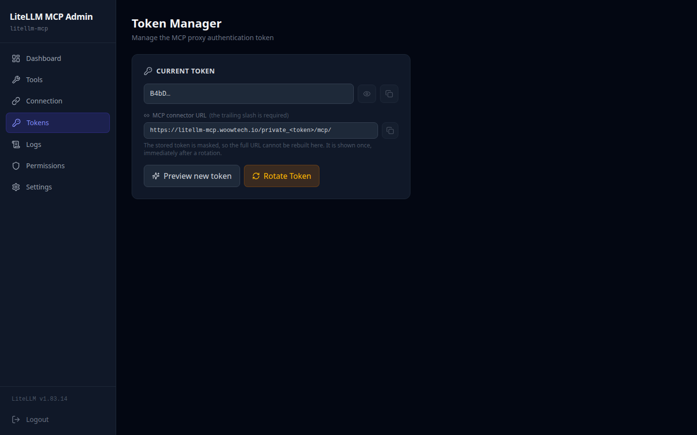
</div>

### Admin console — logs

A live tail of the server's in-memory ring buffer over Server-Sent Events. At capture
time the header read `Live · 1504 shown · 1504 buffered`, meaning nothing had yet aged
out of the buffer. The stream uses `EventSource` with `withCredentials: true` so it
rides the httpOnly cookie rather than appending the JWT to the URL.

<div align="center">
  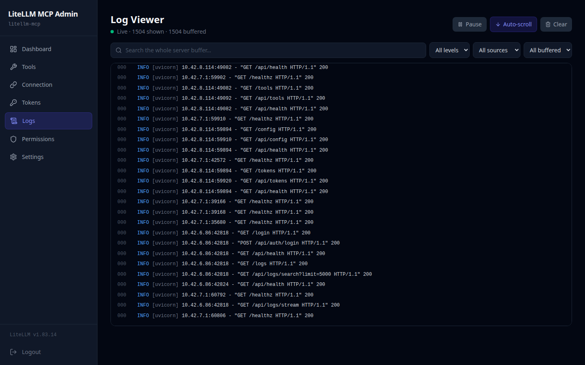
</div>

### Admin console — permissions

The category, operation and read-only gates, edited without touching environment
variables. Changes here write through to the config store on the PVC and take effect on
the next child restart, because gating is applied at tool-registration time rather than
per call.

<div align="center">
  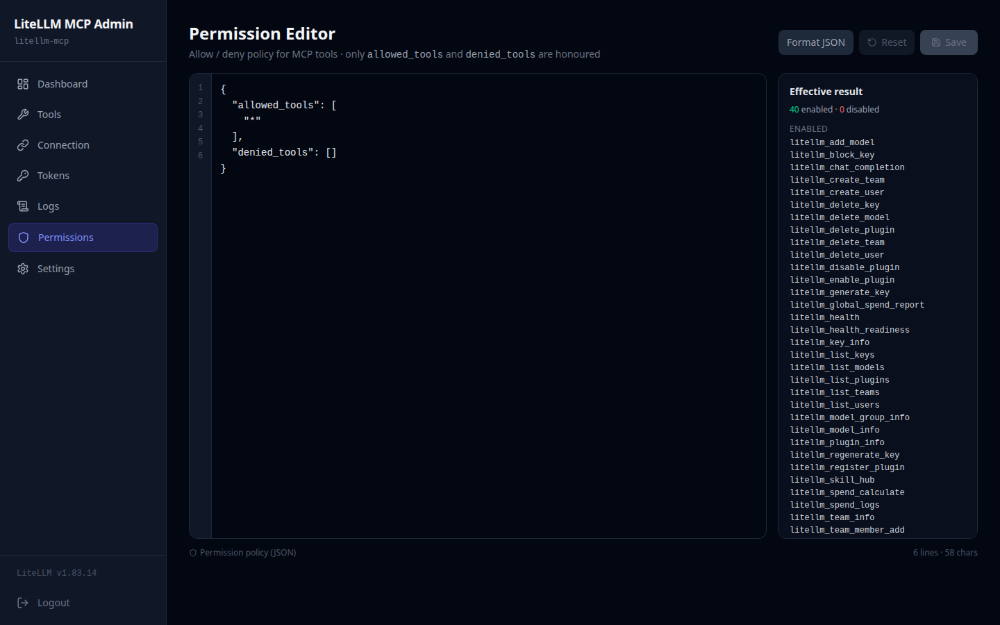
</div>

### Admin console — settings

Process-level controls: the admin password, JWT expiry, and the proxy timeout — set to
`86400` seconds (24 hours) on this deployment so long-lived MCP sessions are not cut
off mid-conversation. Restarting the MCP child from this page is the supported way to
apply a permission change.

<div align="center">
  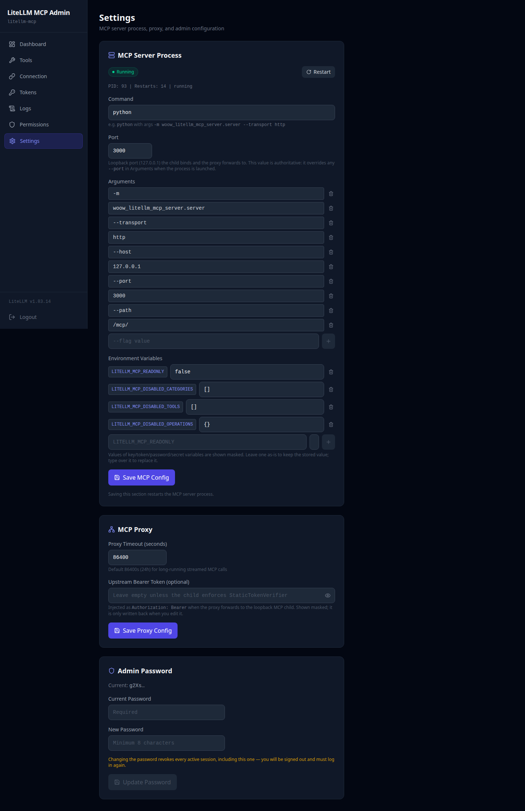
</div>

### LiteLLM gateway — login

The upstream gateway's own UI at `https://litellm.woowtech.io/ui/`. This is a separate
authentication domain from the MCP console: it takes the LiteLLM admin credentials,
not the console's `admin_password`. The MCP server never uses this UI — it talks to the
gateway's REST API with the master key.

<div align="center">
  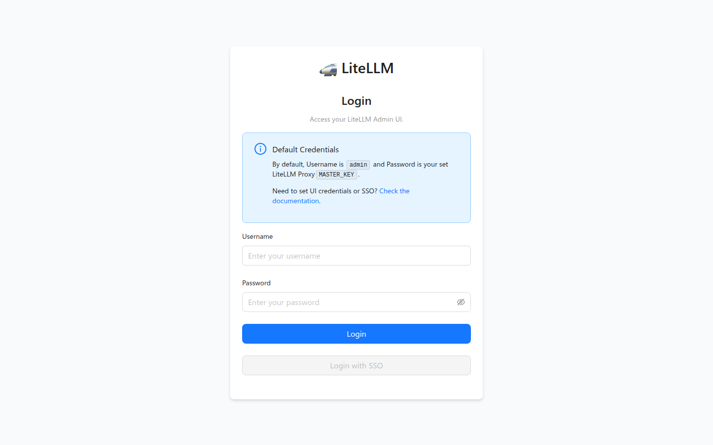
</div>

### LiteLLM gateway — dashboard

The gateway's virtual-key overview. Every key the MCP `keys` tools create, block or
regenerate appears here, which makes this page the independent check on whether a tool
call actually did what it reported.

<div align="center">
  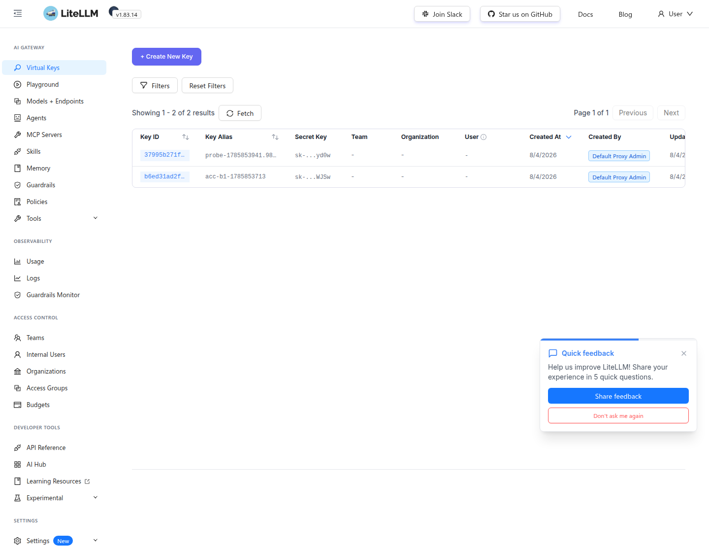
</div>

### LiteLLM gateway — models

The five deployments this gateway serves, all routed through OpenRouter and all
reporting healthy at capture time (`healthy_count: 5, unhealthy_count: 0`).

| Model name | Upstream | Context | Input $/tok | Output $/tok | Notable |
|------------|----------|---------|-------------|--------------|---------|
| `claude-sonnet-4.5` | `openrouter/anthropic/claude-sonnet-4.5` | 1,000,000 | 3.0e-6 | 1.5e-5 | vision, computer use, cache write 3.75e-6 / read 3.0e-7 |
| `glm-4.6` | `openrouter/z-ai/glm-4.6` | 202,800 | 4.0e-7 | 1.75e-6 | function calling, reasoning, prompt caching; max_tokens 131,000 |
| `minimax-m2` | `openrouter/minimax/minimax-m2` | 204,800 | 2.55e-7 | 1.02e-6 | lowest cost per token of the paid tier |
| `gpt-4o-mini` | `openrouter/openai/gpt-4o-mini` | — | 0 | 0 | cost tracking not configured |
| `llama-3.3-70b` | `openrouter/meta-llama/llama-3.3-70b-instruct` | — | 0 | 0 | cost tracking not configured |

<div align="center">
  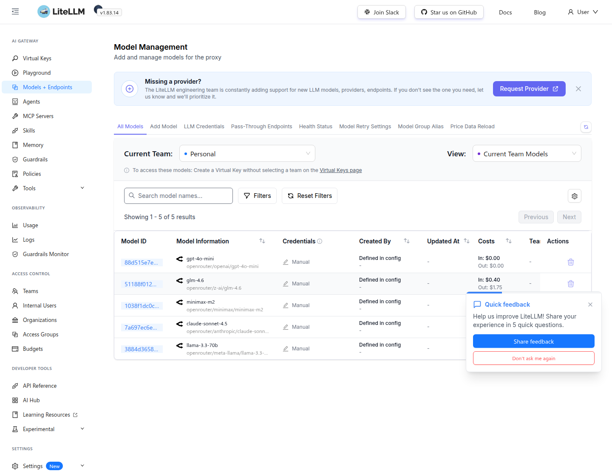
</div>

### LiteLLM gateway — MCP servers

LiteLLM v1.83.14 can itself register MCP servers, which is a distinct concern from this
repository: that feature lets the *gateway* call MCP tools, whereas this project lets
MCP clients call the *gateway*. The page is included because the two are easy to
confuse when reading the LiteLLM docs.

<div align="center">
  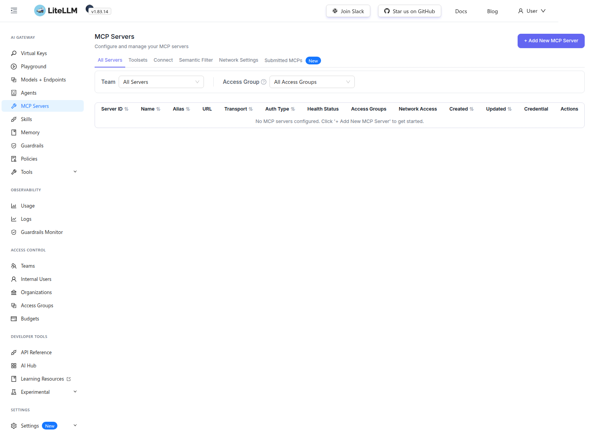
</div>

### LiteLLM gateway — usage

The real seven-day window, 29 July to 5 August 2026: **$0.0111 total spend**, **174
requests** of which **141 succeeded** and **33 failed**, **7,467 tokens**, averaging
**$0.0001 per request**. All spend is attributed to the single `openrouter` provider.
The 33 failures are the expected shape for a period that included live gating and
error-path tests — a request rejected by a gate never reaches the provider, so it
counts as failed here while costing nothing.

<div align="center">
  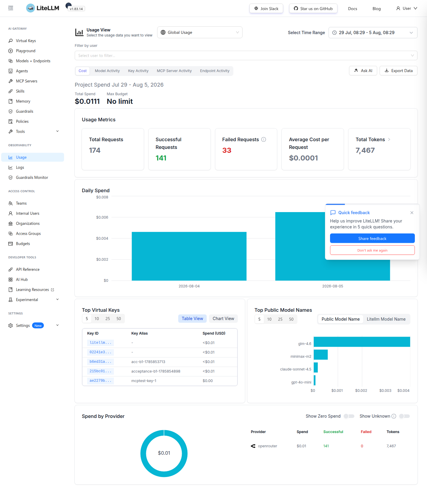
</div>

### LiteLLM gateway — logs

Per-request records with model, token counts and cost. Cross-referencing an MCP
`litellm_chat_completion` call against this page is how the end-to-end path was
verified: the tool reports a completion, and the row appears here with a matching token
count.

<div align="center">
  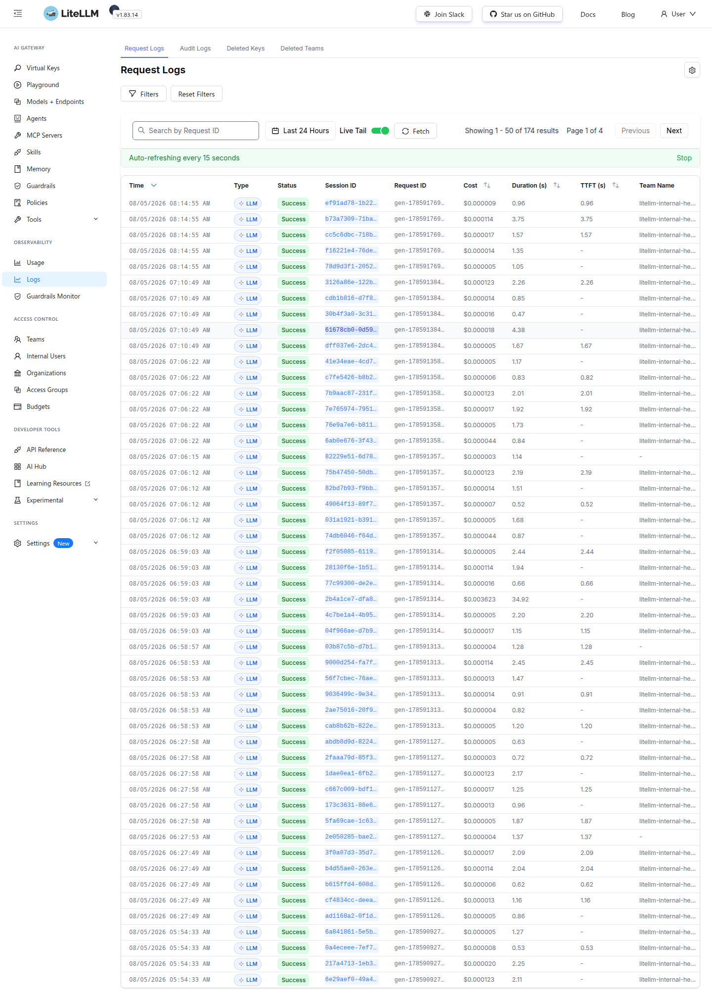
</div>

---

## Installation

There is **one** deployed shape: the admin console, which spawns the MCP server as a
loopback child process and publishes it through the token-gated proxy. Everything below
is either that shape or a local-development convenience.

### Option 1 — bare MCP server, local development only

The smallest way to exercise the tools: no console, no proxy, just the 40 tools over
stdio or Streamable-HTTP. **This is not a deployment path.** Nothing authenticates the
HTTP interface, so bind it to loopback unless you know precisely who can reach the
address you bind instead.

```bash
git clone https://github.com/WOOWTECH/Woow_litellm_mcp_server.git
cd Woow_litellm_mcp_server
pip install .

export LITELLM_MCP_BASE_URL=http://localhost:4000
export LITELLM_MCP_MASTER_KEY=sk-...        # never commit this

# Streamable-HTTP, loopback
python -m woow_litellm_mcp_server.server \
  --transport http --host 127.0.0.1 --port 8000 --path /mcp/

# or stdio, for a local MCP client
python -m woow_litellm_mcp_server.server --transport stdio
```

### Option 2 — admin console via Docker Compose

```bash
cp .env.example .env      # set JWT_SECRET and the LITELLM_MCP_* values
docker compose up --build
```

The two-stage `Dockerfile` builds the SPA on `node:20-alpine`, then runs
`uvicorn litellm_mcp_admin.main:app` on `python:3.12-slim` at `:8080`. Log in with the
`admin_password` from the config store (default `admin` — change it on first login),
point the Connection page at your gateway, and toggle tools on the Tools page.

### Option 3 — Kubernetes: console + encrypted proxy + MCP child

The supported production deployment. No image build and no private registry: init
containers clone this public repo into an `emptyDir`, build the SPA and seed the config
PVC, and the main container `pip install`s `.[admin]` and serves the console on `:8080`.

```bash
kubectl apply -f k8s-base.yaml           # namespace + litellm-mcp-secret
kubectl apply -f k8s-admin-deploy.yaml   # console + encrypted proxy + MCP child + PVC
```

`k8s-base.yaml` ships placeholder secrets; replace them before or immediately after
applying, and on a cluster that already holds real values, skip that file entirely rather
than overwriting a live master key with `sk-REPLACE_ME`.

Point a Cloudflare tunnel or any ingress at
`http://litellm-mcp-admin.litellm-mcp.svc.cluster.local:8080`. The only public MCP door
is then `/private_<mcp_auth_token>/mcp/`. Design notes, verification commands and the
Cloudflare Bot Fight Mode caveat are in
[`docs/encrypted-proxy.md`](./docs/encrypted-proxy.md).

Expect a two-and-a-half to three minute cold start while the three init containers run.

> **Upgrading from an earlier revision?** The repository used to ship a second manifest,
> `k8s-deploy.yaml`, that ran the server bare on `0.0.0.0:8000` behind `Service/litellm-mcp`
> with no authentication — and because that file also carried the shared namespace and
> secret, the documented apply order produced the ungated endpoint whether you wanted it
> or not. It has been removed (FINDING-003 in [`findings.md`](./findings.md)). Clean up an
> existing cluster with:
>
> ```bash
> kubectl delete deployment litellm-mcp-server -n litellm-mcp
> kubectl delete service    litellm-mcp        -n litellm-mcp
> # Keep the namespace and Secret/litellm-mcp-secret — the console needs both.
> ```
>
> Nothing is lost: the console never dialled `litellm-mcp:8000`.

### Connecting an MCP client

Add the endpoint as a custom connector:

```
https://<your-admin-hostname>/private_<mcp_auth_token>/mcp/
```

Rotating `mcp_auth_token` from the Tokens page invalidates that URL immediately, so
plan rotations around connected clients.

---

## Configuration

Server settings use the `LITELLM_MCP_` prefix and are read by
`woow_litellm_mcp_server/settings.py` via pydantic-settings.

| Environment variable | Default | Meaning |
|---|---|---|
| `LITELLM_MCP_BASE_URL` | `http://localhost:4000` | Gateway base URL, no path suffix. |
| `LITELLM_MCP_MASTER_KEY` | _(empty)_ | Bearer master/admin key. Keep it in a Secret. |
| `LITELLM_MCP_READONLY` | `false` | Drop every mutating tool at registration. |
| `LITELLM_MCP_DISABLED_CATEGORIES` | _(empty)_ | CSV of categories to drop, e.g. `keys,teams`. |
| `LITELLM_MCP_DISABLED_TOOLS` | _(empty)_ | CSV of tool names to drop. |
| `LITELLM_MCP_DISABLED_OPERATIONS` | _(empty)_ | CSV of `tool:op` or bare `op` gates. |
| `LITELLM_MCP_DEFAULT_LIMIT` | `50` | Default page size for list tools. |
| `LITELLM_MCP_MAX_LIMIT` | `500` | Hard ceiling on page size. |
| `LITELLM_MCP_REQUEST_TIMEOUT` | `60` | Per-request HTTP timeout, seconds. |

Console settings: `MCP_ADMIN_CONFIG` (path to the JSON config store, `/data/config.json`
on the PVC deployment), `JWT_SECRET` and `JWT_EXPIRY_HOURS`. The proxy timeout is stored
in the config rather than the environment and is set to `86400` on the live deployment.

Python dependencies, from `pyproject.toml`:

```toml
dependencies = ["fastmcp>=2.0", "mcp>=1.2", "httpx>=0.27",
                "pydantic>=2.6", "pydantic-settings>=2.2"]

[project.optional-dependencies]
admin = ["fastapi>=0.115", "uvicorn[standard]>=0.30", "pyjwt>=2.9",
         "python-multipart>=0.0.9", "sse-starlette>=2.1"]
test  = ["pytest>=8.0", "pytest-asyncio>=0.23", "httpx>=0.27"]
dev   = ["woow-litellm-mcp-server[admin,test]", "ruff>=0.5"]
```

---

## Security

**What "encrypted proxy" means here, precisely.** It means path-token isolation, a
JWT-gated GUI and TLS at the Cloudflare edge. It does **not** mean at-rest payload
encryption: the config store is plaintext JSON protected by file permissions
(`chmod 600`) and by secret-masking in every API response. Saying so plainly matters
more than the marketing word.

**Secrets never enter the repository.** The LiteLLM master key, the salt key and the
admin password live in Kubernetes Secrets and the container environment only.
`k8s-base.yaml` and `k8s-admin-deploy.yaml` ship placeholders only. Every config API
response masks secret fields, and the master key is write-only — settable, never
readable.

**`LITELLM_SALT_KEY` must be set once and never rotated.** LiteLLM uses it to encrypt
columns in its database; rotating it renders every previously encrypted value
undecryptable. This is a property of the upstream gateway, not of this project, and it
is the single most damaging mistake available in this stack.

**Rotate `mcp_auth_token` deliberately.** Rotation is instant and unforgiving: the old
`/private_<token>/mcp/` URL stops resolving the moment the new one is written, and every
connected MCP client fails until repointed. The Tokens page separates "generate a
preview" from "rotate the live value" for exactly this reason.

**Destructive tools are opt-out, not opt-in.** All eight ship enabled. For any agent
that does not need them, set `LITELLM_MCP_READONLY=true` or list them in
`LITELLM_MCP_DISABLED_TOOLS`. Because gating happens at registration, a disabled tool
is invisible rather than merely refused — the stronger of the two guarantees.

**The MCP child is loopback-only.** It binds `127.0.0.1` and is reachable exclusively
through the proxy route. A misconfigured ingress cannot accidentally expose it, because
there is no address to expose.

---

## API Reference

All 40 tools, generated from `woow_litellm_mcp_server/registry.py`. Every name is
prefixed `litellm_`. "Ops" is the `operations` tuple that
`LITELLM_MCP_DISABLED_OPERATIONS` matches against; "Danger" marks the eight tools whose
docstrings carry the `[DESTRUCTIVE]` prefix.

| Tool | Category | Method | Path | Ops | Danger |
|---|---|---|---|---|---|
| `litellm_list_models` | models | GET | `/v1/models` | read | — |
| `litellm_model_info` | models | GET | `/model/info` | read | — |
| `litellm_model_group_info` | models | GET | `/model_group/info` | read | — |
| `litellm_add_model` | models | POST | `/model/new` | create | — |
| `litellm_update_model` | models | POST | `/model/update` | update | — |
| `litellm_delete_model` | models | POST | `/model/delete` | delete | ⚠ |
| `litellm_chat_completion` | chat | POST | `/v1/chat/completions` | create | — |
| `litellm_token_counter` | chat | POST | `/utils/token_counter` | read | — |
| `litellm_generate_key` | keys | POST | `/key/generate` | create | — |
| `litellm_list_keys` | keys | GET | `/key/list` | read | — |
| `litellm_key_info` | keys | GET | `/key/info` | read | — |
| `litellm_update_key` | keys | POST | `/key/update` | update | — |
| `litellm_delete_key` | keys | POST | `/key/delete` | delete | ⚠ |
| `litellm_block_key` | keys | POST | `/key/block` | update | ⚠ |
| `litellm_unblock_key` | keys | POST | `/key/unblock` | update | — |
| `litellm_regenerate_key` | keys | POST | `/key/{key}/regenerate` | update | ⚠ |
| `litellm_create_team` | teams | POST | `/team/new` | create | — |
| `litellm_list_teams` | teams | GET | `/v2/team/list` | read | — |
| `litellm_team_info` | teams | GET | `/team/info` | read | — |
| `litellm_update_team` | teams | POST | `/team/update` | update | — |
| `litellm_delete_team` | teams | POST | `/team/delete` | delete | ⚠ |
| `litellm_team_member_add` | teams | POST | `/team/member_add` | create | — |
| `litellm_team_member_delete` | teams | POST | `/team/member_delete` | delete | ⚠ |
| `litellm_create_user` | users | POST | `/user/new` | create | — |
| `litellm_list_users` | users | GET | `/user/list` | read | — |
| `litellm_user_info` | users | GET | `/user/info` | read | — |
| `litellm_update_user` | users | POST | `/user/update` | update | — |
| `litellm_delete_user` | users | POST | `/user/delete` | delete | ⚠ |
| `litellm_spend_logs` | spend | GET | `/spend/logs` | read | — |
| `litellm_global_spend_report` | spend | GET | `/spend/logs` | read | — |
| `litellm_spend_calculate` | spend | POST | `/spend/calculate` | read | — |
| `litellm_health` | health | GET | `/health` | read | — |
| `litellm_health_readiness` | health | GET | `/health/readiness` | read | — |
| `litellm_list_plugins` | plugins | GET | `/claude-code/plugins` | read | — |
| `litellm_plugin_info` | plugins | GET | `/claude-code/plugins/{plugin_name}` | read | — |
| `litellm_register_plugin` | plugins | POST | `/claude-code/plugins` | create | — |
| `litellm_delete_plugin` | plugins | DELETE | `/claude-code/plugins/{plugin_name}` | delete | ⚠ |
| `litellm_enable_plugin` | plugins | POST | `/claude-code/plugins/{plugin_name}/enable` | update | — |
| `litellm_disable_plugin` | plugins | POST | `/claude-code/plugins/{plugin_name}/disable` | update | — |
| `litellm_skill_hub` | plugins | GET | `/public/skill_hub` | read | — |
| **TOTAL** | **8 categories** | | | **18 read-only** | **8 dangerous** |

### Admin HTTP API

| Route | Method | Purpose |
|---|---|---|
| `/api/auth/login` | POST | Exchange `{ password }` for a JWT; also sets the httpOnly cookie. |
| `/api/auth/logout` | POST | Expire the cookie. |
| `/api/config` | GET / PUT | Read and write the connection config (secrets masked on read). |
| `/api/tools` | GET / PUT | Read and write per-tool enablement. |
| `/api/tokens/generate` | POST | Preview a candidate `mcp_auth_token` without committing it. |
| `/api/tokens/rotate` | POST | Commit a new token. **Destroys the live MCP URL.** |
| `/api/logs/stream` | GET (SSE) | Tail the ring buffer. |
| `/api/health` | GET | Console and MCP-child health. |
| `/private_{token}/mcp/` | ANY | The proxied MCP endpoint. |

### SPA routes

`/login`, `/` (dashboard), `/tools`, `/config`, `/tokens`, `/logs`, `/permissions`,
`/settings`, and a catch-all that redirects to `/`.

---

## Testing

```bash
pip install -e ".[admin,test]"
pytest                 # mocked; live probes deselected by default
pytest -m live         # opt-in; requires a reachable LiteLLM gateway
```

Latest run: **133 passed, 2 deselected, 1 warning in 0.98s** — 135 cases collected
across 13 modules.

| Module | Covers |
|---|---|
| `test_mcp_surface.py` | The registry↔GUI invariant: the console can never name a tool the server lacks. |
| `test_gating.py` | All four gating axes, individually and in combination. |
| `test_gated_tool_message.py` | A gated tool is absent from `tools/list`, not merely refused. |
| `test_tool_requests.py` | Each tool builds the correct method, path and body. |
| `test_model_param_contracts.py` | Model-tool parameter shapes against LiteLLM's schema. |
| `test_spend_tools.py` | Spend and cost-report response parsing. |
| `test_admin_tools_api.py` | The console's tool enable/disable API. |
| `test_config_probe_binding.py` | The Connection page's readiness probe. |
| `test_connection_wiring.py` | Config store → client construction. |
| `test_client_lifetime.py` | httpx client creation, reuse and teardown. |
| `test_errors.py` | LiteLLM error bodies surface intact to the MCP caller. |
| `test_log_stream.py` | SSE ring-buffer streaming. |
| `test_live_litellm.py` | Opt-in probes against a real gateway (the 2 deselected). |
| **TOTAL** | **135 collected · 133 passing · 2 deselected** |

---

## Changelog

### v0.3.0 — August 2026

Documentation and verification pass against the live deployment. Corrected the tool
count from 38 to 40 (**FINDING-001**): the README had drifted from the registry after
`litellm_plugin_info` and `litellm_delete_plugin` were added, and the `plugins` category
was under-documented by two entries. Added the full 40-row generated tool catalogue so
the count can no longer drift silently. Captured fourteen screenshots and every metric
in this document from the running services rather than from memory (**FINDING-002**).
Added bilingual READMEs, four architecture diagrams in both ASCII and Mermaid, and the
`docs/` supplement set.

### v0.2.0 — July 2026

Encrypted proxy and admin console. Added `mcp_admin_core` as a product-agnostic layer,
the path-token proxy route, the JWT-gated React console and the registryless Kubernetes
manifests. Fixed the SSE stream leaking the JWT into uvicorn's access log by moving
authentication to an httpOnly cookie with `withCredentials` (**BUG-1**). Fixed the
config PVC being clobbered on redeploy by making `seed-config` idempotent (**BUG-2**).
Fixed `RollingUpdate` deadlocking on the `ReadWriteOnce` PVC by switching to `Recreate`
(**BUG-3**). Made the SPA build non-fatal so a frontend break degrades the console
instead of crash-looping the pod (**BUG-4**).

### v0.1.0 — June 2026

Initial release. FastMCP server, the `ToolSpec` registry, the four gating axes, the
typed LiteLLM client and the mocked test suite.

---

## Support

- **Issues and feature requests** — open an issue on
  [the GitHub repository](https://github.com/WOOWTECH/Woow_litellm_mcp_server/issues).
- **Deployment questions** — start with [`docs/deployment.md`](./docs/deployment.md) and
  [`docs/encrypted-proxy.md`](./docs/encrypted-proxy.md), which cover the runbook, the
  proxy design, verification commands and the Cloudflare Bot Fight Mode caveat that
  bites most first-time tunnel setups.
- **Contributing** — see [CONTRIBUTING.md](./CONTRIBUTING.md). New tools must be added to
  `registry.py` first; `tests/test_mcp_surface.py` will fail the build otherwise.

---

## License

Released under the [MIT License](./LICENSE).

LiteLLM is licensed separately by [BerriAI](https://github.com/BerriAI/litellm); this
project administers a LiteLLM gateway but does not redistribute it.

Model access is subject to the terms of the upstream providers reached through
OpenRouter.

---

<div align="center">
  <sub>Built with ❤️ by <a href="https://github.com/WOOWTECH">WOOWTECH</a> &bull; Powered by LiteLLM v1.83.14</sub>
</div>
