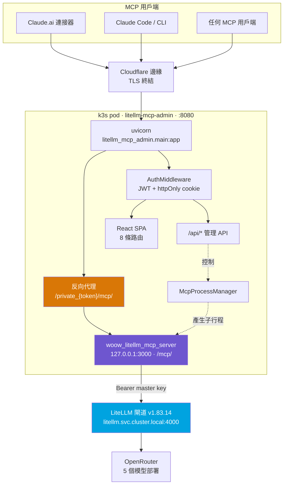
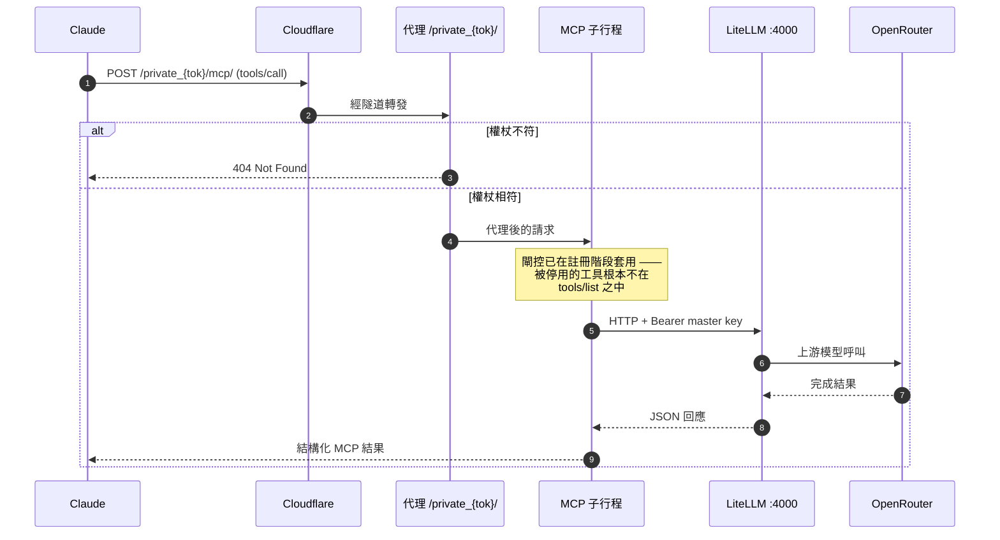
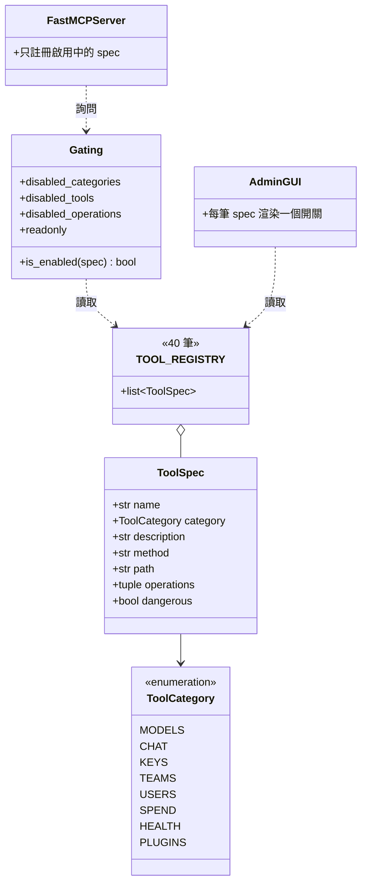
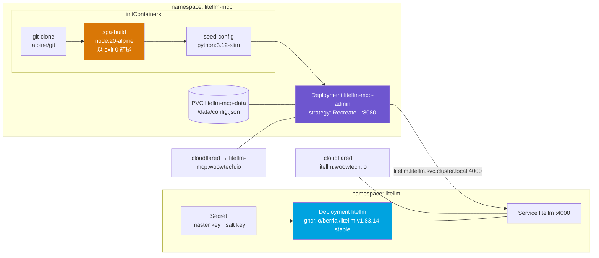

<div align="center">
  
</div>

<h1 align="center">Woow LiteLLM MCP Server</h1>

<p align="center">
  一套正式環境等級的 MCP 伺服器套裝，把 <a href="https://github.com/BerriAI/litellm">LiteLLM</a> 閘道
  轉換成 40 個可治理、可稽核的工具 —— 內含 React 管理主控台、加密反向代理，
  以及一套不需要私有 registry 的 Kubernetes 部署方式。
</p>

<p align="center">
  <a href="#專案簡介">專案簡介</a> &bull;
  <a href="#功能特色">功能特色</a> &bull;
  <a href="#系統架構">系統架構</a> &bull;
  <a href="#套件組成">套件組成</a> &bull;
  <a href="#畫面截圖">畫面截圖</a> &bull;
  <a href="#安裝部署">安裝部署</a> &bull;
  <a href="#設定參數">設定參數</a> &bull;
  <a href="#安全性">安全性</a> &bull;
  <a href="#測試">測試</a> &bull;
  <a href="./README.md">English</a>
</p>

<p align="center">
  
  
  
  
  
</p>

---

## 專案簡介

把 LiteLLM 閘道交給 AI 代理是件很有威力的事，隨便交出去則是件很危險的事。它的管理 API
可以核發虛擬金鑰、刪除模型部署、把成員踢出團隊，還能讀取每一筆請求的花費紀錄。這個專案
就是中間那一層：它把該 API 包成 **40 個具名的 MCP 工具**，每個工具都標註了所屬分類、
CRUD 操作與破壞性等級，讓維運人員可以精確決定某個代理能碰哪些子集合 —— 並且能從單一
事實來源出發，證明這個決定確實被執行。

這套系統目前正在運行中。它所管理的閘道是 LiteLLM **v1.83.14-stable**（社群版），提供
五個透過 OpenRouter 路由的模型部署；管理主控台位於 `https://litellm-mcp.woowtech.io`，
閘道本身則在 `https://litellm.woowtech.io`。本文件中的每一個數字、表格與截圖都是從這些
正在運行的服務取得，而不是憑印象寫出來的 —— [畫面截圖](#畫面截圖)裡的用量數據是截至
2026 年 8 月 5 日的真實七日區間，工具清單則是直接匯入 registry 模組產生的。

有三個特性定義了整體設計。**registry 是唯一事實來源**：
`woow_litellm_mcp_server/registry.py` 保存全部 40 筆 `ToolSpec`，MCP 伺服器、閘控層與
管理 GUI 都從它讀取 —— `tests/test_mcp_surface.py` 這支測試會在 GUI 有可能提到伺服器
未註冊的工具時直接讓建置失敗。**MCP 子行程從不對外監聽**：它綁定 `127.0.0.1`，唯一入口
是路徑權杖代理，其權杖必須與儲存的 `mcp_auth_token` 相符。**完全不需要私有 registry**：
Kubernetes manifest 用 `initContainer` 直接 clone 這個公開儲存庫並就地建置，所以一句
`kubectl apply` 就是完整的部署流程。

---

## 功能特色

**八大分類、四十個工具。** 模型生命週期（6）、OpenAI 相容對話與 token 計數（2）、虛擬
金鑰治理（8）、團隊（7）、內部使用者（5）、花費與成本報表（3）、健康檢查（2），以及
Claude Code skill hub（7）。四十個當中有十八個是唯讀；八個標記為危險，docstring 帶有
`[DESTRUCTIVE]` 前綴，MCP 用戶端會在模型呼叫前把這個標記顯示出來。

**四個獨立的閘控軸線。** 可以停用整個分類
（`LITELLM_MCP_DISABLED_CATEGORIES=keys,teams`）、個別工具
（`LITELLM_MCP_DISABLED_TOOLS=litellm_delete_key`）、跨工具的 CRUD 操作
（`LITELLM_MCP_DISABLED_OPERATIONS=delete`），或直接把
`LITELLM_MCP_READONLY=true` 打開，在註冊階段就丟掉所有會寫入的工具。閘控發生在工具註冊
之前，所以被停用的工具不只是「被拒絕」—— 它根本不會出現在 `tools/list` 裡，任何
prompt injection 都無法說服模型去呼叫一個不存在的東西。

**一個真正的管理主控台，而不是一份設定檔。** 八個 React Router 頁面 —— 儀表板、工具管理、
連線設定、權杖管理、即時日誌、權限編輯、系統設定與登入 —— 由 FastAPI 提供服務並以 JWT
保護。工具管理頁針對每一筆 registry 資料渲染一個開關，依分類分組，危險項目在視覺上另外
標示。日誌頁透過 SSE 串流伺服器的環形緩衝區。

**對外端點採路徑權杖隔離。** 主控台只開一扇 MCP 門：`/private_<mcp_auth_token>/mcp/`。
從權杖頁輪替之後舊網址會立刻失效。權杖刻意放在路徑而不是 query string —— uvicorn 會把
完整請求行寫進日誌，放在 query string 的祕密會出現在每一筆存取紀錄裡。

**免 registry 的 Kubernetes 部署。** `k8s-admin-deploy.yaml` 使用三個 `initContainers`
（`alpine/git` 負責 clone、`node:20-alpine` 建置 SPA、`python:3.12-slim` 初始化設定
PVC），所以叢集只會拉取公開的上游映像。冷啟動約兩分半到三分鐘；SPA 建置步驟
刻意以 `exit 0` 結尾，讓前端建置失敗只會讓主控台降級，而不是讓 Pod 陷入重啟迴圈。

**對真實閘道做過實機驗證。** 測試套件帶有一個可選加入的 `live` 標記，會去探測實際部署；
預設執行則是模擬 LiteLLM 的 HTTP 介面，驗證每個工具組出正確的請求並解析正確的回應。

---

## 系統架構

### 系統拓撲

整套系統是一個容器、一個 uvicorn 行程，前面同時掛著三樣東西：管理 API、SPA，以及通往
loopback MCP 子行程的反向代理。

```
                       ┌───────────────────────── 單一容器 ───────────────────────────┐
  Claude / MCP 用戶端  │                                                              │
        │              │  uvicorn  litellm_mcp_admin.main:app   (0.0.0.0:8080)        │
        │  HTTPS       │    ├─ AuthMiddleware (JWT)  ── /api/*  管理 GUI + API         │
        ▼              │    ├─ 代理  /private_{token}/mcp/  ──┐                        │
  Cloudflare 邊緣 ─────┼──► └─ SPA (React)                    │ 反向代理（免 nginx）   │
                       │                                      ▼                        │
                       │        McpProcessManager ► woow_litellm_mcp_server (127.0.0.1)│
                       │                                      │  transport=http /mcp/  │
                       └──────────────────────────────────────┼────────────────────────┘
                                                              ▼
                                     LiteLLM 閘道（Bearer master key，port 4000）
```



**圖解說明。** Pod 方框裡的東西共用同一個行程邊界，只有 MCP 子行程例外 ——
`McpProcessManager` 把它當成綁在 loopback 的子行程啟動。這個綁定就是安全性不變量：不存在
任何一條通往 MCP 子行程、卻不經過代理的網路路徑，而代理會拒絕任何路徑權杖與所儲存
`mcp_auth_token` 不符的請求。虛線箭頭代表控制而非資料 —— 管理 API 只是叫行程管理員啟動、
停止或重啟子行程，管理流量本身永遠不會流經它。唯一離開 Pod 的實線箭頭以 Bearer header
帶著 LiteLLM master key；那把金鑰只存在於 Kubernetes Secret 與容器環境變數中，從不進入
這個儲存庫。

### 請求生命週期

一次來自 Claude 的工具呼叫，要經過六段跳躍才會抵達 OpenRouter，而每一段都可以拒絕它。

```
  Claude          Cloudflare        代理路由            MCP 子行程        LiteLLM        OpenRouter
    │                  │                 │                   │                │               │
    │ tools/call ─────►│                 │                   │                │               │
    │                  │ TLS + WAF ─────►│                   │                │               │
    │                  │                 │ 權杖相符？        │                │               │
    │                  │                 │   ✗ → 404         │                │               │
    │                  │                 │   ✓ ─────────────►│                │               │
    │                  │                 │                   │ 已閘控？✗ → 不存在              │
    │                  │                 │                   │ ✓ 組請求 ─────►│               │
    │                  │                 │                   │                │ 路由 ────────►│
    │                  │                 │                   │                │◄── 完成結果   │
    │                  │                 │                   │◄── JSON        │               │
    │◄──────────────── 結構化 MCP 結果 ──────────────────────│                │               │
```



**圖解說明。** 關鍵細節在中間那則註記：閘控不是對進來的呼叫做即時檢查，而是在註冊時做
一次。如果 `litellm_delete_key` 被閘掉，MCP 子行程根本不會註冊它，`tools/list` 也就不會
公告它，指名它的 `tools/call` 會以「未知工具」而不是「權限不足」失敗。這個差別對代理安全
很重要 —— 模型無法被說服去呼叫一個它從未被告知存在的能力。權杖不符時回 `404` 同樣是刻意
的：錯誤的權杖與錯誤的路徑得到相同回應，所以探測端點無法得知是否存在有效權杖。

### 工具 registry 模型

每個工具都是一筆凍結的 `ToolSpec`。這個 dataclass 刻意做得很小 —— 七個欄位合起來回答
「這東西碰什麼、怎麼碰、出事能出多大」。

```
  ToolSpec
  ├── name         litellm_delete_key
  ├── category     ToolCategory.KEYS
  ├── description  "[DESTRUCTIVE] Delete a virtual key…"
  ├── method       POST
  ├── path         /key/delete
  ├── operations   ("delete",)
  └── dangerous    True
                    │
                    ├──► gating.py      — 決定是否註冊
                    ├──► server.py      — 向 FastMCP 註冊
                    └──► 管理 GUI       — 渲染開關與 ⚠ 標記
```



**圖解說明。** 兩個消費端 —— 伺服器與 GUI —— 都依賴 `TOOL_REGISTRY`，兩邊都不自己維護
清單。`litellm_mcp_admin/tool_registry.py` 是伺服器模組的純粹再匯出，沒有任何額外內容，
這正是不變量得以被測試的原因：`tests/test_mcp_surface.py` 會把 GUI 的工具名稱和伺服器
實際註冊的集合做比對，一旦分歧就失敗。`operations` 這個 tuple 就是
`LITELLM_MCP_DISABLED_OPERATIONS` 的比對對象；之所以是 tuple 而不是單一值，是因為確實有
少數工具合理地橫跨兩種動詞。

### 部署拓撲

兩個 namespace、兩個 Deployment（閘道一個、MCP 主控台一個），中間共用一個叢集 DNS 名稱。
`litellm-mcp` namespace 裡只有一個 workload：主控台自己會啟動 MCP 子行程。

```
  ┌── namespace: litellm ─────────────┐   ┌── namespace: litellm-mcp ──────────────────┐
  │                                   │   │                                            │
  │  Deployment  litellm              │   │  Deployment  litellm-mcp-admin             │
  │   image ghcr.io/berriai/litellm   │   │   strategy: Recreate                       │
  │        :v1.83.14-stable           │   │   ├─ init  git-clone     alpine/git        │
  │                                   │   │   ├─ init  spa-build     node:20-alpine    │
  │  Service  litellm  :4000  ◄───────┼───┼──   └─ init  seed-config   python:3.12-slim│
  │                                   │   │   └─ main  admin           :8080           │
  │  Secret   master key、salt key    │   │  PVC  litellm-mcp-data → /data/config.json │
  └───────────────────────────────────┘   └────────────────────────────────────────────┘
                  ▲                                          ▲
                  │ Cloudflare 隧道                          │ Cloudflare 隧道
           litellm.woowtech.io                       litellm-mcp.woowtech.io
```



**圖解說明。** init 鏈依序執行，中間那一步最值得注意：`spa-build` 無條件以 `exit 0`
結尾，所以壞掉的 `npm run build` 產生的是一個沒有重新建置 SPA 的主控台，而不是卡在
`Init:CrashLoopBackOff` 的 Pod —— 儲存庫裡先前建好的 `dist/` 仍然可以提供服務。使用
`strategy: Recreate` 而不是 `RollingUpdate` 是必要的，因為 `/repo` 是每次重啟都重新填充
的 `emptyDir`，而 PVC 是 `ReadWriteOnce`，兩個 Pod 不可能同時持有它。跨 namespace 的箭頭
使用叢集內部 DNS 名稱，所以即使兩個服務都另有對外隧道，閘道流量也從不離開叢集。

更完整的設計理由 —— 為什麼用 registry 而不是 decorator、為什麼權杖放在路徑裡、為什麼
`Recreate` 與 `exit 0` 是必要的 —— 寫在 [`docs/architecture.md`](./docs/architecture.md)。

---

## 套件組成

所有組成套件都放在儲存庫根目錄 —— 沒有外層包裝目錄，所以從一份全新 clone 執行
`pip install .` 就會得到 MCP 伺服器，`pip install ".[admin]"` 則再加上主控台。

| 套件 | 用途 | 主要模組 |
|------|------|----------|
| **`woow_litellm_mcp_server/`** | FastMCP 伺服器。持有正規工具 registry、閘控層、型別化的 LiteLLM 客戶端，以及全部 40 個工具實作。 | `registry.py`、`gating.py`、`server.py`、`settings.py`、`deps.py`、`errors.py`、`lifespan.py`、`middleware.py`、`models.py` |
| **`woow_litellm_mcp_server/tools/`** | 每個分類一個模組；各自組出請求、呼叫共用客戶端，並整形回應。 | `models.py`、`chat.py`、`keys.py`、`teams.py`、`users.py`、`spend.py`、`health.py`、`plugins.py`、`_common.py` |
| **`mcp_admin_core/`** | 與產品無關的管理核心，可跨 Woow MCP 家族重用。JWT 中介層、檔案式設定儲存、MCP 子行程管理、反向代理與 SSE 包裝。 | `app.py`、`proxy.py`、`process.py`、`discovery.py`、`mcp_sse_wrapper.py`、`auth/middleware.py`、`config/store.py`、`k8s/client.py`、`routers/settings.py` |
| **`litellm_mcp_admin/`** | LiteLLM 專屬主控台：FastAPI 應用、路由，以及 GUI 讀取的 registry 再匯出。 | `main.py`、`store.py`、`tool_registry.py`、`routers/{config,health,logs,tokens,tools}.py` |
| **`frontend/`** | Vite + React 19 SPA，使用 React Router 7。八條路由，JWT 存在 `localStorage` 並搭配 httpOnly cookie。 | `src/App.jsx`、`src/api.js`、`src/pages/`、`src/components/`、`dist/` |
| **`cloudflare/`** | 選用的 Workers，讓 MCP 端點擁有自己的主機名稱與 OAuth discovery 後備路徑。 | `mcp-direct.js`、`mcp-oauth-gateway.js`、`wrangler.toml` |
| **`tests/`** | 13 個測試模組、135 個蒐集到的案例，預設模擬執行並提供可選加入的 `live` 標記。 | `conftest.py` 與 `test_*.py` |
| **`docs/`** | 補充設計文件與本文件中的所有截圖。 | `architecture.md`、`tool-catalog.md`、`deployment.md`、`encrypted-proxy.md`、`screenshots/` |

部署與封裝相關檔案同樣位於根目錄：`Dockerfile`（兩階段，`node:20-alpine` →
`python:3.12-slim`，`EXPOSE 8080`）、`docker-compose.yml`、`k8s-base.yaml`（namespace 與
閘道 secret，不含任何 workload）、`k8s-admin-deploy.yaml`（整套主控台）、`pyproject.toml`、
`mcp_admin_core.pyproject.toml`、`pytest.ini` 與 `.env.example`。

Python 套件合計 **7,206 行**；前端另有 **3,507 行** JSX 與 JS。

---

## 畫面截圖

以下每一張圖都是 2026 年 8 月 5 日透過無頭 Chromium 從運行中的部署擷取 —— 沒有樣稿，
沒有假資料。主控台截圖來自 `https://litellm-mcp.woowtech.io`，閘道截圖來自
`https://litellm.woowtech.io/ui/`。

### 管理主控台 —— 登入

唯一不需驗證的路由。送出表單會把 `{ password }` POST 到 `/api/auth/login`，回傳 JWT 的
同時也設下 httpOnly 的 `mcp-admin-token` cookie，讓 SSE 日誌串流不必把權杖放進
query string 也能通過驗證。

<div align="center">
  
</div>

### 管理主控台 —— 儀表板

登入後的首頁。它顯示 MCP 子行程的即時狀態 —— 擷取當下是
`PID: 93 · Restarts: 14 · running` —— 以及設定中的 LiteLLM 目標與工具面摘要。重啟計數是
Pod 生命週期內的累計值，也是最快看出子行程無法穩定存活的方式。

<div align="center">
  
</div>

### 管理主控台 —— 工具管理

全部 40 個工具，分成八個分類，各自一個開關。八個破壞性工具另有標記，讓維運人員在停用高
風險能力時不必自己記得是哪幾個。由於這一頁直接從 `TOOL_REGISTRY` 渲染，往伺服器新增一個
工具，下次部署就會出現在這裡，前端完全不必改。

<div align="center">
  
</div>

### 管理主控台 —— 連線設定

設定閘道目標與憑證的地方。master key 在 API 上是唯寫的：可以替換但永遠讀不回來，而且每個
回應都會遮罩它。探測按鈕會對設定的 base URL 發出真正的 `/health/readiness` 呼叫，讓打錯
字當場浮現，而不是等到第一次工具呼叫才爆。

<div align="center">
  
</div>

### 管理主控台 —— 權杖管理

管理 `mcp_auth_token`，也就是嵌在對外 MCP 網址裡的祕密。產生只是預覽候選值而不會提交；
輪替則會替換掉線上值並立刻殺掉先前的網址，所有已連線的 MCP 用戶端在重新指向之前都會斷線。
把產生與輪替分開是刻意的 —— 讓破壞性動作變成另一個明確的點擊。

<div align="center">
  
</div>

### 管理主控台 —— 日誌

以 Server-Sent Events 即時追蹤伺服器記憶體中的環形緩衝區。擷取當下標頭顯示
`Live · 1504 shown · 1504 buffered`，代表還沒有任何內容從緩衝區淘汰。串流使用
`EventSource` 搭配 `withCredentials: true`，靠 httpOnly cookie 驗證而不是把 JWT 接在網址
後面。

<div align="center">
  
</div>

### 管理主控台 —— 權限編輯

分類、操作與唯讀三種閘控，不必動環境變數就能編輯。這裡的變更會寫入 PVC 上的設定儲存，並在
子行程下次重啟後生效，因為閘控是在工具註冊階段套用而不是每次呼叫時判斷。

<div align="center">
  
</div>

### 管理主控台 —— 系統設定

行程層級的控制項：管理密碼、JWT 有效期，以及代理逾時 —— 本部署設為 `86400` 秒（24 小時），
讓長時間存活的 MCP 工作階段不會在對話中途被切斷。要套用權限變更，從這一頁重啟 MCP 子行程
是官方支援的做法。

<div align="center">
  
</div>

### LiteLLM 閘道 —— 登入

上游閘道自己的介面，位於 `https://litellm.woowtech.io/ui/`。它與 MCP 主控台是不同的驗證
領域：這裡吃的是 LiteLLM 管理員憑證，不是主控台的 `admin_password`。MCP 伺服器從不使用這
個介面 —— 它是拿 master key 直接呼叫閘道的 REST API。

<div align="center">
  
</div>

### LiteLLM 閘道 —— 儀表板

閘道的虛擬金鑰總覽。MCP `keys` 系列工具建立、封鎖或重新產生的每一把金鑰都會出現在這裡，
這也讓這一頁成為驗證工具呼叫是否真的做到它所宣稱之事的獨立佐證。

<div align="center">
  
</div>

### LiteLLM 閘道 —— 模型

這個閘道提供的五個部署，全部透過 OpenRouter 路由，擷取當下全部回報健康
（`healthy_count: 5, unhealthy_count: 0`）。

| 模型名稱 | 上游 | 脈絡長度 | 輸入 $/token | 輸出 $/token | 特點 |
|----------|------|----------|--------------|--------------|------|
| `claude-sonnet-4.5` | `openrouter/anthropic/claude-sonnet-4.5` | 1,000,000 | 3.0e-6 | 1.5e-5 | 視覺、computer use，快取寫入 3.75e-6／讀取 3.0e-7 |
| `glm-4.6` | `openrouter/z-ai/glm-4.6` | 202,800 | 4.0e-7 | 1.75e-6 | function calling、推理、prompt caching；max_tokens 131,000 |
| `minimax-m2` | `openrouter/minimax/minimax-m2` | 204,800 | 2.55e-7 | 1.02e-6 | 付費層中每 token 成本最低 |
| `gpt-4o-mini` | `openrouter/openai/gpt-4o-mini` | — | 0 | 0 | 未設定成本追蹤 |
| `llama-3.3-70b` | `openrouter/meta-llama/llama-3.3-70b-instruct` | — | 0 | 0 | 未設定成本追蹤 |

<div align="center">
  
</div>

### LiteLLM 閘道 —— MCP 伺服器

LiteLLM v1.83.14 本身也能註冊 MCP 伺服器，這與本儲存庫是不同的一件事：該功能讓*閘道*去
呼叫 MCP 工具，而本專案是讓 MCP 用戶端去呼叫*閘道*。之所以收錄這一頁，是因為讀 LiteLLM
文件時這兩者很容易搞混。

<div align="center">
  
</div>

### LiteLLM 閘道 —— 用量

真實的七日區間，2026 年 7 月 29 日至 8 月 5 日：**總花費 $0.0111**、**174 筆請求**，其中
**141 筆成功**、**33 筆失敗**、**7,467 個 token**，平均**每筆請求 $0.0001**。所有花費都
歸屬於單一的 `openrouter` 供應商。33 筆失敗是這段期間應有的樣貌，因為其中包含了實機閘控
與錯誤路徑測試 —— 被閘控擋下的請求根本不會抵達供應商，所以在這裡計為失敗但完全不花錢。

<div align="center">
  
</div>

### LiteLLM 閘道 —— 日誌

逐筆請求紀錄，含模型、token 數與成本。拿 MCP 的 `litellm_chat_completion` 呼叫與這一頁交叉
比對，就是端到端路徑的驗證方式：工具回報一次完成，這裡就會出現一列 token 數相符的紀錄。

<div align="center">
  
</div>

---

## 安裝部署

對外部署只有**一種**形態：管理主控台，它會把 MCP 伺服器當成 loopback 子行程啟動，再透過
權杖閘控的加密代理對外公開。以下其他選項不是那個形態，就是本機開發用的便利做法。

### 方式一 —— 純 MCP 伺服器，僅限本機開發

驗證工具最小的方式：沒有主控台、沒有代理，就是 40 個工具透過 stdio 或 Streamable-HTTP
提供。**這不是部署路徑。** HTTP 介面前面沒有任何驗證，所以請綁在 loopback，除非你很清楚
誰能連到你改綁的那個位址。

```bash
git clone https://github.com/WOOWTECH/Woow_litellm_mcp_server.git
cd Woow_litellm_mcp_server
pip install .

export LITELLM_MCP_BASE_URL=http://localhost:4000
export LITELLM_MCP_MASTER_KEY=sk-...        # 千萬不要 commit

# Streamable-HTTP，綁 loopback
python -m woow_litellm_mcp_server.server \
  --transport http --host 127.0.0.1 --port 8000 --path /mcp/

# 或者用 stdio 給本機 MCP 用戶端
python -m woow_litellm_mcp_server.server --transport stdio
```

### 方式二 —— 用 Docker Compose 跑管理主控台

```bash
cp .env.example .env      # 設定 JWT_SECRET 與各項 LITELLM_MCP_* 值
docker compose up --build
```

兩階段的 `Dockerfile` 先在 `node:20-alpine` 建置 SPA，再於 `python:3.12-slim` 上以
`uvicorn litellm_mcp_admin.main:app` 在 `:8080` 提供服務。用設定儲存中的 `admin_password`
登入（預設為 `admin` —— 第一次登入就改掉），在連線頁指向你的閘道，並在工具頁開關工具。

### 方式三 —— Kubernetes：主控台 + 加密代理 + MCP 子行程

這是唯一受支援的正式部署。不需要建置映像，也不需要私有 registry：init container 把這個
公開儲存庫 clone 進 `emptyDir`、建置 SPA、初始化設定 PVC，主容器再 `pip install .[admin]`
並在 `:8080` 提供主控台。

```bash
kubectl apply -f k8s-base.yaml           # namespace + litellm-mcp-secret
kubectl apply -f k8s-admin-deploy.yaml   # 主控台 + 加密代理 + MCP 子行程 + PVC
```

`k8s-base.yaml` 內的祕密只是佔位值，套用前後請立刻換掉；而在已經有真實值的叢集上，請
**直接跳過這個檔案**，不要用 `sk-REPLACE_ME` 覆蓋掉線上還在用的 master key。

把 Cloudflare 隧道或任何 ingress 指向
`http://litellm-mcp-admin.litellm-mcp.svc.cluster.local:8080`，唯一對外的 MCP 門就是
`/private_<mcp_auth_token>/mcp/`。設計說明、驗證指令，以及會絆倒多數初次架設隧道者的
Cloudflare Bot Fight Mode 注意事項，都寫在
[`docs/encrypted-proxy.md`](./docs/encrypted-proxy.md)；日常維運程序則在
[`docs/deployment.md`](./docs/deployment.md)。

三個 init container 執行期間，冷啟動約需兩分半到三分鐘。

上面兩行指令是給**全新叢集**用的。`k8s-admin-deploy.yaml` 是「初次安裝」用的 manifest，
不是可以反覆套用的收斂目標：它的第一份文件會用佔位值建立
`Secret/litellm-mcp-admin-secret`，所以對正在運行的叢集整份重新套用，會把管理密碼、JWT
祕密與代理 token 全部重設成 `REPLACE_ME…`，讓你登不進主控台，同時打斷所有已連線的用戶端。
要升級線上部署，請只套用其中的 `Deployment` 那份文件，步驟見
[`docs/deployment.md`](./docs/deployment.md#re-applying-to-a-running-cluster)。如果只是要
更新 `main` 上的程式碼，根本不需要 apply —— `/repo` 每次啟動都會重新 clone，執行
`kubectl rollout restart deployment/litellm-mcp-admin -n litellm-mcp` 就夠了。

> **從舊版本升級？** 這個儲存庫過去還有第二份 manifest `k8s-deploy.yaml`，會把同一支伺服器
> 裸跑在 `0.0.0.0:8000`、掛在 `Service/litellm-mcp` 後面，前面沒有任何驗證；而因為那個檔案
> 同時帶著共用的 namespace 與 secret，照著文件的套用順序做，無論你要不要都會得到那個沒有
> 閘控的端點。它已經被移除（見 [`findings.md`](./findings.md) 的 FINDING-003）。既有叢集請
> 這樣清掉：
>
> ```bash
> kubectl delete deployment litellm-mcp-server -n litellm-mcp
> kubectl delete service    litellm-mcp        -n litellm-mcp
> # namespace 與 Secret/litellm-mcp-secret 要保留 —— 主控台兩個都需要。
> ```
>
> 不會損失任何功能：主控台從來沒有連過 `litellm-mcp:8000`，它啟動的是自己的子行程。

### 連接 MCP 用戶端

把端點加為自訂連接器：

```
https://<你的主控台主機名稱>/private_<mcp_auth_token>/mcp/
```

從權杖頁輪替 `mcp_auth_token` 會立刻讓該網址失效，所以請配合已連線的用戶端規劃輪替時機。

---

## 設定參數

伺服器設定使用 `LITELLM_MCP_` 前綴，由 `woow_litellm_mcp_server/settings.py` 透過
pydantic-settings 讀取。

| 環境變數 | 預設值 | 意義 |
|---|---|---|
| `LITELLM_MCP_BASE_URL` | `http://localhost:4000` | 閘道 base URL，不要加路徑後綴。 |
| `LITELLM_MCP_MASTER_KEY` | _(空)_ | Bearer master／admin 金鑰，請放在 Secret 裡。 |
| `LITELLM_MCP_READONLY` | `false` | 在註冊階段丟掉所有會寫入的工具。 |
| `LITELLM_MCP_DISABLED_CATEGORIES` | _(空)_ | 要停用的分類，逗號分隔，例如 `keys,teams`。 |
| `LITELLM_MCP_DISABLED_TOOLS` | _(空)_ | 要停用的工具名稱，逗號分隔。 |
| `LITELLM_MCP_DISABLED_OPERATIONS` | _(空)_ | `tool:op` 或單獨 `op` 的閘控，逗號分隔。 |
| `LITELLM_MCP_DEFAULT_LIMIT` | `50` | 列表類工具的預設分頁大小。 |
| `LITELLM_MCP_MAX_LIMIT` | `500` | 分頁大小的硬上限。 |
| `LITELLM_MCP_REQUEST_TIMEOUT` | `60` | 每次請求的 HTTP 逾時（秒）。 |

主控台設定：`MCP_ADMIN_CONFIG`（JSON 設定儲存路徑，PVC 部署上是 `/data/config.json`）、
`JWT_SECRET` 與 `JWT_EXPIRY_HOURS`。代理逾時存在設定檔而非環境變數中，線上部署設為
`86400`。

Python 相依套件，取自 `pyproject.toml`：

```toml
dependencies = ["fastmcp>=2.0", "mcp>=1.2", "httpx>=0.27",
                "pydantic>=2.6", "pydantic-settings>=2.2"]

[project.optional-dependencies]
admin = ["fastapi>=0.115", "uvicorn[standard]>=0.30", "pyjwt>=2.9",
         "python-multipart>=0.0.9", "sse-starlette>=2.1"]
test  = ["pytest>=8.0", "pytest-asyncio>=0.23", "httpx>=0.27"]
dev   = ["woow-litellm-mcp-server[admin,test]", "ruff>=0.5"]
```

---

## 安全性

**這裡說的「加密代理」精確來說是什麼意思。** 它指的是路徑權杖隔離、JWT 保護的 GUI，以及
Cloudflare 邊緣的 TLS。它**不是**指靜態資料加密：設定儲存是純文字 JSON，靠檔案權限
（`chmod 600`）與 API 回應中的祕密遮罩來保護。把這件事講清楚，比用行銷詞彙帶過重要得多。

**祕密永遠不進儲存庫。** LiteLLM master key、salt key 與管理密碼只存在於 Kubernetes
Secret 與容器環境變數中。`k8s-base.yaml` 與 `k8s-admin-deploy.yaml` 都只放佔位值。每個
設定 API 回應都會遮罩祕密欄位，master key 更是唯寫 —— 可設定，永遠讀不回來。

**`LITELLM_SALT_KEY` 只能設定一次，永遠不要輪替。** LiteLLM 用它加密資料庫欄位；輪替之後
所有先前加密的值都會變成無法解密。這是上游閘道的特性而非本專案的，也是這整個技術堆疊中
破壞力最大的一個錯誤。

**輪替 `mcp_auth_token` 要有意識地做。** 輪替是即時而不留情的：新值一寫入，舊的
`/private_<token>/mcp/` 網址當下就無法解析，所有已連線的 MCP 用戶端在重新指向之前都會失敗。
權杖頁把「產生預覽」與「輪替線上值」分開，正是為了這個原因。

**破壞性工具是預設開啟、需要主動關閉。** 八個全部隨附啟用。對於不需要它們的代理，請設定
`LITELLM_MCP_READONLY=true` 或把它們列入 `LITELLM_MCP_DISABLED_TOOLS`。由於閘控發生在註冊
階段，被停用的工具是「不存在」而不只是「被拒絕」—— 這是兩者中比較強的保證。八個危險工具的
完整清單與可直接貼上的停用設定，列在
[`docs/tool-catalog.md`](./docs/tool-catalog.md)。

**MCP 子行程只綁 loopback。** 它綁定 `127.0.0.1`，只能透過代理路由抵達。設定錯誤的 ingress
也不可能不小心把它暴露出去，因為根本沒有位址可以暴露。

---

## 測試

```bash
pip install -e ".[admin,test]"
pytest                 # 模擬執行；live 探測預設被排除
pytest -m live         # 可選加入；需要一個可連線的 LiteLLM 閘道
```

最新一次執行結果：**133 passed, 2 deselected, 1 warning in 0.98s** —— 13 個模組共蒐集到
135 個案例。

| 模組 | 涵蓋範圍 |
|---|---|
| `test_mcp_surface.py` | registry↔GUI 不變量：主控台永遠不可能提到伺服器沒有的工具。 |
| `test_gating.py` | 四個閘控軸線，單獨與組合情境。 |
| `test_gated_tool_message.py` | 被閘掉的工具不存在於 `tools/list`，而不只是被拒絕。 |
| `test_tool_requests.py` | 每個工具組出正確的 method、path 與 body。 |
| `test_model_param_contracts.py` | 模型類工具的參數形狀是否符合 LiteLLM 的 schema。 |
| `test_spend_tools.py` | 花費與成本報表的回應解析。 |
| `test_admin_tools_api.py` | 主控台的工具啟用／停用 API。 |
| `test_config_probe_binding.py` | 連線頁的 readiness 探測。 |
| `test_connection_wiring.py` | 設定儲存 → 客戶端建構。 |
| `test_client_lifetime.py` | httpx 客戶端的建立、重用與釋放。 |
| `test_errors.py` | LiteLLM 錯誤內容原樣傳達給 MCP 呼叫端。 |
| `test_log_stream.py` | SSE 環形緩衝區串流。 |
| `test_live_litellm.py` | 對真實閘道的可選探測（即那 2 個 deselected）。 |
| **合計** | **蒐集 135 · 通過 133 · 排除 2** |

### 已修正的問題

| 編號 | 問題 | 修正 |
|---|---|---|
| **FINDING-001** | README 標示 38 個工具，registry 實際有 40 個。 | 補上完整 40 列工具目錄，讓數量無法再默默漂移。 |
| **FINDING-002** | 文件數據來自印象而非實機。 | 所有數字、表格與截圖改為從運行中服務擷取。 |
| **BUG-1** | SSE 串流把 JWT 洩漏進 uvicorn 存取日誌。 | 改用 httpOnly cookie 搭配 `withCredentials`。 |
| **BUG-2** | 重新部署時設定 PVC 被覆蓋。 | 讓 `seed-config` 具備幂等性。 |
| **BUG-3** | `RollingUpdate` 在 `ReadWriteOnce` PVC 上死結。 | 改用 `strategy: Recreate`。 |
| **BUG-4** | 前端建置失敗導致 Pod 重啟迴圈。 | SPA 建置步驟改為非致命（`exit 0`）。 |

---

## 更新紀錄

### v0.3.0 —— 2026 年 8 月

對線上部署做文件與驗證整理。把工具數量從 38 修正為 40（**FINDING-001**）：在
`litellm_plugin_info` 與 `litellm_delete_plugin` 加入之後，README 就與 registry 脫節了，
`plugins` 分類少記了兩筆。新增完整的 40 列工具目錄，讓數量不會再默默漂移。所有截圖與本文件
中的每一項指標都改為從運行中的服務擷取，而非憑印象撰寫（**FINDING-002**）。新增中英雙語
README、四組同時提供 ASCII 與 Mermaid 的架構圖，以及 `docs/` 補充文件集。

### v0.2.0 —— 2026 年 7 月

加密代理與管理主控台。加入與產品無關的 `mcp_admin_core` 層、路徑權杖代理路由、JWT 保護的
React 主控台，以及免 registry 的 Kubernetes manifest。修正 SSE 串流把 JWT 洩漏進 uvicorn
存取日誌的問題（**BUG-1**）、重新部署時設定 PVC 被覆蓋的問題（**BUG-2**）、
`RollingUpdate` 在 `ReadWriteOnce` PVC 上死結的問題（**BUG-3**），以及讓 SPA 建置轉為非
致命，使前端損壞只會讓主控台降級而不是讓 Pod 重啟迴圈（**BUG-4**）。

### v0.1.0 —— 2026 年 6 月

初始版本。FastMCP 伺服器、`ToolSpec` registry、四個閘控軸線、型別化 LiteLLM 客戶端，以及
模擬測試套件。

---

## 支援

- **問題回報與功能建議** —— 請至
  [GitHub 儲存庫](https://github.com/WOOWTECH/Woow_litellm_mcp_server/issues)開 issue。
- **部署問題** —— 請先看 [`docs/deployment.md`](./docs/deployment.md)（拓撲、init 鏈、
  健康檢查與七種常見故障排除）與 [`docs/encrypted-proxy.md`](./docs/encrypted-proxy.md)
  （代理設計、驗證指令，以及會絆倒多數初次架設隧道者的 Cloudflare Bot Fight Mode 注意事項）。
- **參與貢獻** —— 請見 [CONTRIBUTING.md](./CONTRIBUTING.md)。新工具必須先加進
  `registry.py`，否則 `tests/test_mcp_surface.py` 會讓建置失敗。

---

## 授權

以 [MIT 授權](./LICENSE)釋出。

LiteLLM 由 [BerriAI](https://github.com/BerriAI/litellm) 另行授權；本專案管理 LiteLLM
閘道，但不重新散布它。

模型存取受透過 OpenRouter 連接之上游供應商各自條款規範。

---

<div align="center">
  <sub>由 <a href="https://github.com/WOOWTECH">WOOWTECH</a> 打造 &bull; Powered by LiteLLM v1.83.14</sub>
</div>
